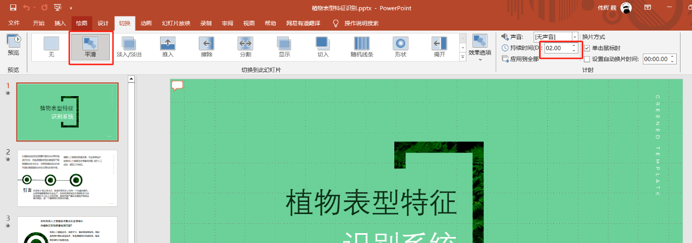

 # 数字人授课录制系统 — 全新的微课视频的生成方案

<h1 align="center">Digital_Human_API</h1>

## 简介
<div align="center">
<br>
</div>

数字人授课录制系统是由AI Horizons团队设计并开发的教育技术工具，旨在通过先进的数字人技术，为教育领域提供个性化、专属化的PPT授课视频制作和展示体验。该系统支持用户自定义数字人形象和声音，简化视频生成流程，提高教学内容的吸引力和教学效率。

## 版本更新

**2024.06更新 (未发布)** 📆: 
- **完成了基础的UI界面。**
- **完成了基础数字人结合ppt生成视频的API框架。**

**2024.07更新 (未发布)** 📆: 
- **更新了UI界面。**
- **加入了VITS的语音合成功能，让数字人的声音更生动。**

**2024.09更新 (开源🔥)** 📆: 
- **开源发布，加入 VITS 的语音训练模块。**
- **令人兴奋的消息！我们将该项目全套开源🔥🔥🔥**
- **把VITS的语音训练模块加入其中，能够通过微调一分钟对应人的语料进行克隆。**
- **该仓库主要开源`Digital_Human_API`，如需参考我们开发的应用程序可以参考`Digital_Human_UI`**

> [!IMPORTANT]
>
> 🔆 该项目也在持续的更新阶段，如果您有任何关于新的模型方法、研究、技术或发现运行错误的建议，请随时编辑并提交 PR。⭐ 如果您发现这个Github Project有用，请给它点个星！🤩🤩

## 系统的核心特点

**生动直观，个性化定制**: 
- **AI数字人形象：采用SadTalker定制化数字人形象，让2D生成生动的3D。**
- **AI数字人声音：采用GPT-SoVITS定制数字人声音，可选预训练声音，或者上传需训练的音频，完成声音自定义。**

**智能、简洁操作：**
- **视频定制：可对生成视频进行设置，如数字人、用户音频。**
- **简易的视频生成：上传ppt即可完成授课视频的生成。**
- **简洁的UI：通过winform设计了简洁的UI设计，使用户更易上手。**

**Digital Human的设计理念是创造一种全新的视频生成方式，也就是说该项目不止是为了生成授课视频，例如PPT内容讲解视频、传统文化讲解视频、公司简介讲解视频等都是我们开发该项目所设想的理念。**

## 效果演示

### 数字人视频生成效果


https://github.com/user-attachments/assets/3f279fea-457c-45d8-90c3-ddd602cc5b46


## 开始使用

### 环境搭建

1. **拉取代码**
   ```bash
   git clone https://github.com/xaio6/Digital_Human_API
   ```

2. **创建环境**
   ```bash
   # 虚拟环境创建
    conda create -n Digital python=3.9
    conda activate Digital

    # pytorch安装方式1（没有安装CUDA）：
    conda install cudatoolkit=11.8 -c https://mirrors.tuna.tsinghua.edu.cn/anaconda/pkgs/free/linux-64/

    conda install cudnn

    pip install torch==2.1.2 torchvision==0.16.2 torchaudio==2.1.2 --index-url https://download.pytorch.org/whl/cu118

    # pytorch安装方式2（已经有安装CUDA，版本为CUDA=11.8）：
    pip install torch==2.1.2 torchvision==0.16.2 torchaudio==2.1.2 --index-url https://download.pytorch.org/whl/cu118
    ```

3. **环境配置**

- **这一步安装过程可能耗时会比较长，可能存在会一些依赖冲突的问题，但是也不会出现太多bug，但是为了更好更方便的安装，可以对冲突的依赖单独安装。**
   ```bash
    # 安装项目依赖
    pip install -r requirements_1.txt -i https://pypi.tuna.tsinghua.edu.cn/simple

    pip install -r requirements_2.txt -i https://pypi.tuna.tsinghua.edu.cn/simple
    ```
    
>⚠️注意在window上，ffmpeg安装可以参考这篇
>http://t.csdnimg.cn/FNUsM
>
>⚠️注意在liunx上，ffmpeg安装可以参考这篇
>http://t.csdnimg.cn/BWt6I

4. **模型下载**

- **接下来还需要安装对应的模型，该项目采用`SadTalker`以及`GPT-SoVITS`，可以根据官方提供的模型下载位置进行下载，这里我提供的的[百度云盘](https://pan.baidu.com/s/1z-yQeOQjI26uYEEipKXJpQ?pwd=axg7)下载
下载完后按照下面的位置进行模型放置：**

    ```bash
    # checkpoints.zip
    该压缩包里面的所有模型需要解压Digital_Human\SadTalker\checkpoints下
    # gfpgan.zip
    该压缩包里面的所有模型需要解压到Digital_Human\SadTalker\gfpgan下
    # GPT_weights.zip
    该压缩包里面的所有模型需要解压到Digital_Human\VITS下
    # SoVITS_weights.zip
    该压缩包里面的所有模型需要解压到Digital_Human\VITS下
    # pretrained_models.zip
    该压缩包里面的所有模型需要解压到Digital_Human\VITS\GPT_SoVITS下
    # weights.zip
    该压缩包里面的所有模型需要解压到Digital_Human\SadTalker\scripts\weights下

    # 更详细的模型放置位置的可以看压缩包里面的 Word 文档
    ```

5. **运行项目**

- **运行项目前，请确保已经安装了所有依赖，并且已经下载了所有模型。**
   ```bash
    # 开启服务
    python server.py
    ```

> [!IMPORTANT]
>
> **⚠️一些常见问题⚠️**
>
> - **gfpgan库的安装问题**
>
>   **解决：**
>   **需要用阿里源下载**
>   ```bash
>   pip install gfpgan==1.3.8 -i https://mirrors.aliyun.com/pypi/simple
>   ```
> - **nltk_data 的下载问题**
>
>   **解决：**
>   
>   **将nltk_data拉取到提示中任意位置（nltk_data在[百度网盘](https://pan.baidu.com/s/1K2rrx0Mjqle75Oo9DHGEoQ?pwd=dw9v)）**


## API 说明
该仓库代码主要是用Flask构建的python后端代码，当启动server.py后，开启的是后端服务，因此，如果需要使用该项目，可以自己搭建一个UI界面或者程序来调用API，当然，你也可以采用我们团队开发的winform界面，可以参考：[Digital_Human_UI]()
<details>
<summary>接口</summary>

## 1. 登录
- **接口**: `/Login`
- **方法**: `POST`
- **描述**: 验证用户登录的账号密码。
- **请求体**:
  ```json
  {
    "User": "用户名",
    "Password": "密码"
  }
  ```
**响应**:
  - **成功**: `result: "Success"`
  - **失败**: `result: "Failed"`


## 2. 获取状态
- **接口**: `/Get_State`
- **方法**: `POST`
- **描述**: 获取特定任务的状态，指在线程池完成的任务功能。
- **请求体**:
  ```json
  {
    "User": "用户名",
    "Task": "任务名"
  }
  ```
- **响应**:
  - **成功**: `result: "任务状态"`
  - **失败**: `result: "Failed"`


## 3. 保存PPT备注信息
- **接口**: `/Send_PPT_Remakes`
- **方法**: `POST`
- **描述**: 保存PPT批注里内容。
- **请求体**:
  ```json
  {
    "User": "用户名",
    "PPT_Remakes": "PPT备注信息"
  }
  ```
- **响应**:
  - **成功**: `result: "Success"`
  - **失败**: `result: "Failed"`


## 4. 保存真人照片
- **接口**: `/Send_Image`
- **方法**: `POST`
- **描述**: 保存用户上传的真人照片。
- **请求体**:
  ```json
  {
    "User": "用户名",
    "Img": "图片的Base64编码"
  }
  ```
- **响应**:
  - **成功**: `result: "Success"`
  - **失败**: `result: "Failed"`


## 5. 配置所有模型参数
- **接口**: `/Send_Config`
- **方法**: `POST`
- **描述**: 配置VITS和SadTalker模型参数。
- **请求体**:
  ```json
  {
    "User": "用户名",
    "VITS_Config": "VITS模型配置",
    "SadTalker_Config": "SadTalker模型配置"
  }
  ```
- **响应**:
  - **成功**: `result: "Success"`
  - **失败**: `result: "Failed"`


## 6. 获取音频时长
- **接口**: `/Recive_Wav_Time`
- **方法**: `POST`
- **描述**: 获取音频文件的时长。
- **请求体**:
  ```json
  {
    "User": "用户名"
  }
  ```
- **响应**:
  - **成功**: `result: "音频时长信息"`
  - **失败**: `result: "Failed"`


## 7. 接收前端视频
- **接口**: `/Send_Video`
- **方法**: `POST`
- **描述**: 接收前端上传的视频文件。
- **请求体**:
  ```json
  {
    "User": "用户名",
    "Json": "视频信息的JSON字符串",
    "File": "视频文件"
  }
  ```
- **响应**:
  - **成功**: `result: "Success"`
  - **失败**: `result: "Failed"`

## 8. 保存用于训练VITS的音频
- **接口**: `/Send_Tarin_Audio`
- **方法**: `POST`
- **描述**: 保存用于训练VITS模型的音频文件。
- **请求体**:
  ```json
  {
    "User": "用户名",
    "Audio_Name": "音频文件名",
    "File": "音频文件"
  }
  ```
- **响应**:
  - **成功**: `result: "Success"`
  - **失败**: `result: "Failed"`

## 9. 训练VITS模型
- **接口**: `/Train_VITS_Model`
- **方法**: `POST`
- **描述**: 训练VITS模型。
- **请求体**:
  ```json
  {
    "User": "用户名",
    "Label": "训练标签"
  }
  ```
- **响应**:
  - **成功**: `result: "VITS_Train"`
  - **失败**: `result: "Failed"`

## 10. 保存VITS的参照音频跟文字
- **接口**: `/Send_Ref_Wav_And_Text`
- **方法**: `POST`
- **描述**: 保存VITS模型训练时使用的参照音频和文字。
- **请求体**:
  ```json
  {
    "User": "用户名",
    "Ref_Text": "参照文字",
    "File": "参照音频文件"
  }
  ```
- **响应**:
  - **成功**: `result: "Success"`
  - **失败**: `result: "Failed"`

## 11. 选择训练的VITS模型
- **接口**: `/Send_Select_Train_VITS_Model`
- **方法**: `POST`
- **描述**: 选择用于训练的VITS模型。
- **请求体**:
  ```json
  {
    "User": "用户名"
  }
  ```
- **响应**:
  - **成功**: `result: "Success"`
  - **失败**: `result: "Failed"`

## 12. 选择VITS模型
- **接口**: `/Send_Select_VITS_Model`
- **方法**: `POST`
- **描述**: 选择VITS模型。
- **请求体**:
  ```json
  {
    "User": "用户名",
    "Index": "模型索引"
  }
  ```
- **响应**:
  - **成功**: `result: "Success"`
  - **失败**: `result: "Failed"`

## 13. 推理效果展示视频
- **接口**: `/Get_Test_Inference`
- **方法**: `POST`
- **描述**: 获取推理效果展示视频。
- **请求体**:
  ```json
  {
    "User": "用户名"
  }
  ```
- **响应**:
  - **成功**: `result: "视频数据的Base64编码"`
  - **失败**: `result: "Failed"`

## 14. 推理VITS
- **接口**: `/Get_Inference_VITS`
- **方法**: `POST`
- **描述**: 进行VITS模型推理。
- **请求体**:
  ```json
  {
    "User": "用户名"
  }
  ```
- **响应**:
  - **成功**: `result: "Success"`
  - **失败**: `result: "Failed"`

## 15. 推理VITS跟Sadtalker
- **接口**: `/Get_Inference`
- **方法**: `POST`
- **描述**: 进行VITS和Sadtalker模型推理。
- **请求体**:
  ```json
  {
    "User": "用户名"
  }
  ```
- **响应**:
  - **成功**: `result: "Audio_Video_Inference"`
  - **失败**: `result: "Failed"`

## 16. PPT跟视频合成
- **接口**: `/PPT_Video_Merge`
- **方法**: `POST`
- **描述**: 将PPT视频和去背景视频合成最终效果视频。
- **请求体**:
  ```json
  {
    "User": "用户名"
  }
  ```
- **响应**:
  - **成功**: `result: "Video_Merge"`
  - **失败**: `result: "Failed"`

## 17. 拉取视频
- **接口**: `/Pull_Video_Merge`
- **方法**: `POST`
- **描述**: 拉取合成的视频。
- **请求体**:
  ```json
  {
    "User": "用户名"
  }
  ```
- **响应**:
  - **成功**: `result: "视频数据的Base64编码"`
  - **失败**: `result: "Failed"`

## 18. 拉取推理的VITS声音
- **接口**: `/Pull_VITS_Audio`
- **方法**: `POST`
- **描述**: 拉取推理后的VITS声音文件。
- **请求体**:
  ```json
  {
    "User": "用户名"
  }
  ```
- **响应**:
  - **成功**: `result: "声音数据的Base64编码"`
  - **失败**: `result: "Failed"`

</details>

## 使用注意事项
⚠️⚠️**客户端程序如果是在windows上使用，则一定要用`PowerPoint`,如果使用`WPS`该API就不能正常工作了**⚠️⚠️

该项目可能存在一些视频生成失败的结果，这就需要外部进行协调来降低这个可能，因此，如果出现了视频生成失败，非常欢迎大家提出建议，激励我们不断优化该项目。

**PPT制作要求：**
- **视频和GIF动画的兼容性说明： 在你的PPT内容中，如果包含视频或GIF动画，请注意，通过本该项目转换生成的授课视频目前不支持这些媒体文件的播放功能。因此，建议PPT内容中不加入视频或GIF动画。**

- **页面过渡动画的设置： 为了使你的PPT演示更加流畅和，我们建议在每一页幻灯片之间`添加过渡动画，切换时间为2秒`,（可保留动画窗格）这样通过本软件生成会效果会更好。（`建议选择平滑`）**


- **幻灯片右下角的空白区域： 在设计PPT时，请在每张幻灯片的右下角预留一个空白区域，用于展示数字人，大概范围可参考下图。**


- **PPT批注内容：需要在对一页都写上对应的讲稿（批注），该系统会自动获取批注内容做为该页的演讲内容，一页ppt只能有一个批注。（同时也可以把讲稿写到一份word里面发给我们）**


**声音训练需求：**
- **录一段1~3分钟以内的WAV音频。**
- **把这个WAV分割多段3~10秒的音频进行提交训练。**
- **音频需要纯洁的人声音频，不能有杂音。**

## 参考
**数字人生成使用的是SadTalker。**

`SadTalker：` **https://github.com/OpenTalker/SadTalker**

**感谢开源贡献，我借鉴了当前开源的语音克隆模型 GPT-SoVITS，效果是相当不错，当然，我也把一些训练好的权重放在了百度云盘里面，可以用于参考使用。**

`GPT-SoVITS` ：**https://github.com/RVC-Boss/GPT-SoVITS**

## 许可协议
本项目遵循 MIT Licence。在使用本工具时，请遵守相关法律，包括版权法、数据保护法和隐私法。未经原作者和/或版权所有者许可，请勿使用本工具。未经原作者和/或版权所有者许可，请勿使用本工具。此外，请确保遵守您参考的模型和组件中的所有许可协议。

## 技术支持和联系方式
如果您在使用过程中遇到任何问题，请联系我们的技术团队：
<div align="center">
<h3>公众号：AI Horizon</h3>

</div>
